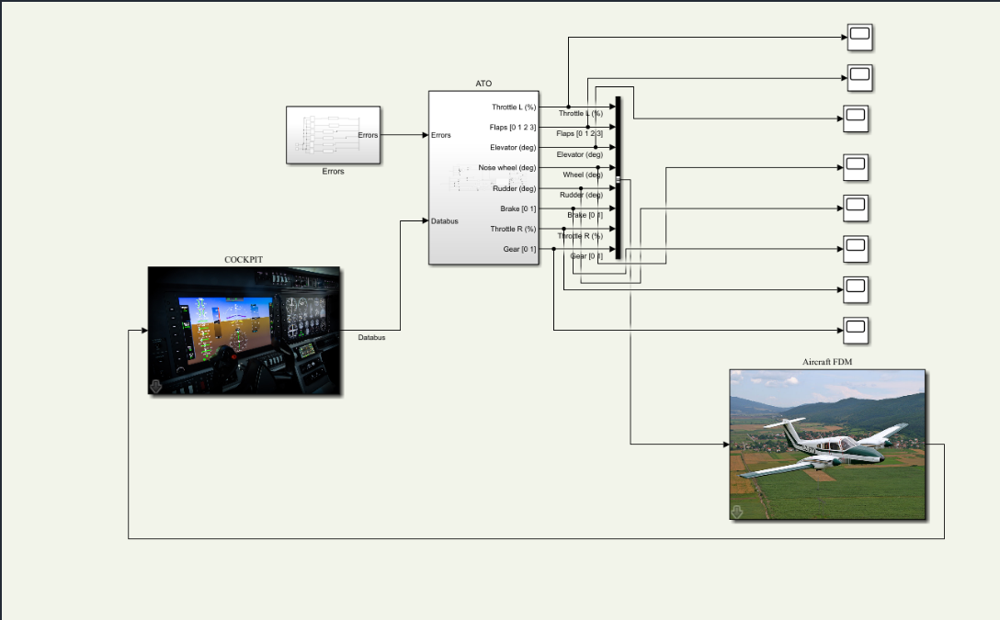
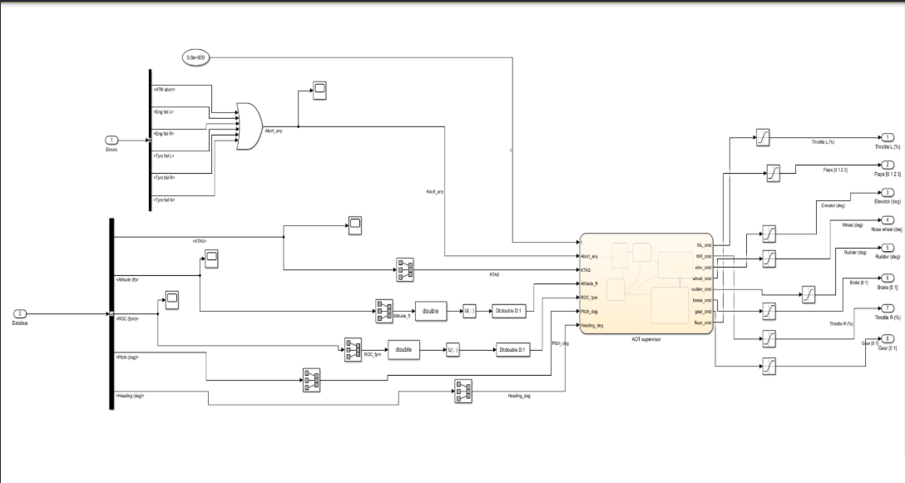
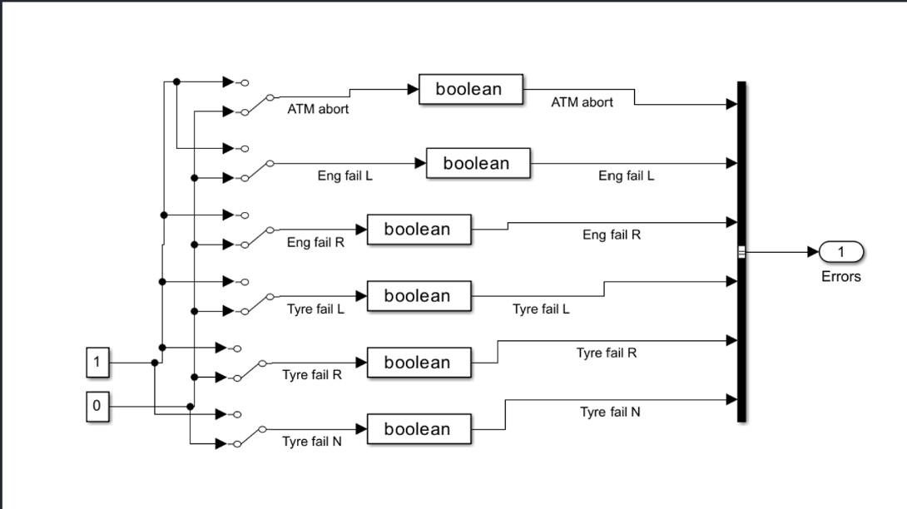

# Automatic Takeoff Supervisory Control System

## Project Overview

This project presents the modeling and implementation of an **Automatic Takeoff (ATO) supervisory control system** for a fixed-wing aircraft using MATLAB and Simulink.

The controller acts as a high-level decision-making layer between the cockpit and the aircraft flight-dynamics model. It monitors aircraft states, system failures, and abort conditions, then generates coordinated commands for the main aircraft actuators during the takeoff sequence.

## Project Objectives

- Develop supervisory logic for automatic takeoff
- Coordinate actuator commands during the takeoff roll and initial climb
- Monitor engine, tyre, and abort-related fault signals
- Generate safe commands under normal and faulted conditions
- Connect the controller with an aircraft flight-dynamics model
- Evaluate normal takeoff and rejected-takeoff behavior in Simulink

## System Architecture

The model contains three main elements:

1. **Cockpit subsystem**  
   Supplies pilot inputs and the aircraft data bus.

2. **ATO supervisory controller**  
   Processes aircraft states, heading, runway information, fault signals, and abort conditions.

3. **Aircraft flight-dynamics model**  
   receives the actuator commands and returns the simulated aircraft response.

The controller generates commands for:

- Left and right throttle
- Flaps
- Elevator
- Nose-wheel steering
- Rudder
- Brakes
- Landing gear

## Fault Monitoring

The fault subsystem includes:

- Automatic takeoff abort
- Left-engine failure
- Right-engine failure
- Left-main-tyre failure
- Right-main-tyre failure
- Nose-tyre failure

The individual Boolean fault signals are combined into an error bus and passed to the ATO supervisory controller.

## How to Run the Simulink Model

### Requirements

- MATLAB
- Simulink
- A 64-bit Windows or Linux system
- The complete extracted `ato_dev_sim` folder

The archive includes compiled MEX files for:

- Windows 64-bit: `.mexw64`
- Linux 64-bit: `.mexa64`

### Run Procedure

1. Extract `ato_dev_sim.zip`.
2. Open MATLAB.
3. Set the MATLAB **Current Folder** to the extracted `ato_dev_sim` folder.
4. Run the initialization script:

```matlab
offlinestart
```

This script:

- runs `InitGlobals.m`;
- enables offline simulation mode;
- defines the offline flight-model name;
- adds the included Simulink libraries and dependencies to the MATLAB path.

5. Open the main model:

```matlab
open_system('ato_dev_sim.slx')
```

6. In Simulink, click **Run**.

The same sequence can be executed from the MATLAB Command Window:

```matlab
cd('C:\path\to\ato_dev_sim')
offlinestart
open_system('ato_dev_sim.slx')
sim('ato_dev_sim')
```

Replace `C:\path\to\ato_dev_sim` with the actual extracted-folder location.

### Important Notes

- Keep the complete folder structure unchanged because the model uses files inside `offline_deps`.
- Do not open only the `.slx` file from inside the ZIP archive.
- Run `offlinestart.m` before the first simulation in each new MATLAB session.
- The `.slxc` and `slprj` items are generated cache files and are not required for understanding the model.
- A macOS system cannot directly use the included Windows and Linux MEX binaries.

## Main Outcomes

- Implemented fault-tolerant automatic-takeoff logic
- Generated coordinated aircraft actuator commands
- Produced safe abort behavior for simulated engine and tyre failures
- Connected cockpit data, supervisory control, and aircraft dynamics
- Demonstrated real-time signal exchange through the data bus
- Evaluated throttle, flap, elevator, rudder, brake, steering, and gear commands

## Project Images

### Complete Simulink Architecture



### Internal ATO Supervisory Logic



### Fault-Input and Error-Bus Logic



## Software Used

- MATLAB
- Simulink
- Supervisory decision logic
- Aircraft flight-dynamics simulation environment

## Engineering Applications

The supervisory-control structure can support later work in:

- Automatic takeoff and landing
- Rejected-takeoff logic
- Fault detection and isolation
- Flight-envelope protection
- Autopilot mode management
- Aircraft health monitoring
- Pilot-assistance systems
- Hardware-in-the-loop testing

## Current Status and Limitations

The model demonstrates automatic-takeoff supervision, actuator-command generation, and fault-response behavior in a simulation environment.

Further development may include:

- decision-speed and runway-length logic;
- crosswind and gust cases;
- sensor noise and actuator delays;
- combined-failure scenarios;
- formal verification of state transitions;
- hardware-in-the-loop testing.

## Suggested Repository Structure

```text
automatic-takeoff-supervisory-control/
├── README.md
├── images/
│   ├── ato_complete_simulink_model.png
│   ├── ato_supervisor_internal_logic.png
│   └── ato_fault_input_logic.png
└── model/
    └── ato_dev_sim.zip
```

The ZIP is retained as a single package so that the required folders, MEX files, initialization scripts, libraries, and model dependencies remain together.

## Author

**Fares Hassan**  
Aerospace Engineering Graduate  
Institute of Space Technology, Islamabad

LinkedIn:  
https://www.linkedin.com/in/fares-hassan-177728273/
